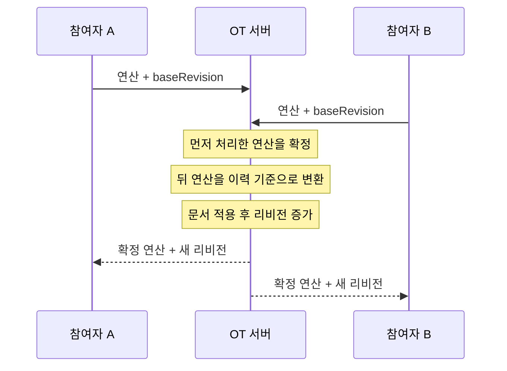
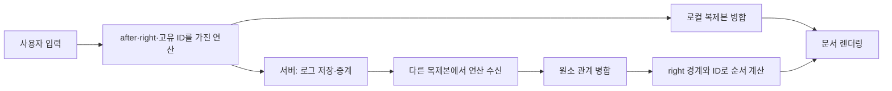

# 동시에 쓰는 문서는 어떻게 하나가 될까?

## 동시 수정

온라인 문서, 메모, 코드 편집기는 여러 사람이 서로 다른 네트워크에서 같은 내용을 동시에 수정합니다.

이때 각 사용자는 자기 입력을 즉시 봐야 하고, 잠시 뒤에는 모두 같은 문서를 봐야 합니다.

이 문제를 해결하는 두 접근인 OT와 CRDT를 비교합니다.

## OT, Operational Transformation

- 여러 사용자의 위치 기반 편집 연산을 변환해, 같은 문서 상태로 수렴하는 방식
- 삽입과 삭제를 `index` 로 만들고, 서버는 이전 연산 이력과 `revision`을 기준으로 `index`를 조정
- 서버가 변환된 연산의 적용 순서를 확정하므로, 모든 사용자가 같은 최종 문서를 보게 됨

## OT의 처리 순서

1. 클라이언트가 현재 서버 `Revision`을 `baseRevision`으로 기록합니다.
2. 사용자의 입력을 삽입·삭제 위치 연산으로 만듭니다.
3. 서버는 `baseRevision` 이후 확정된 이력을 확인합니다.
4. 서버는 새 연산을 그 이력 기준으로 변환합니다.
5. 서버는 변환된 연산을 문서에 적용하고 `Revision`을 증가시킵니다.
6. 서버는 확정 연산과 새 `Revision`을 모든 참여자에게 보냅니다.

## **OT의 처리 흐름**

## CRDT, Conflict-free Replicated Data Type

- 각 참여자가 문서 복제본을 가지고, 고유한 원소와 병합 규칙으로 같은 상태에 수렴하는 방식
- 문자는 고유 ID와 삽입 경계(왼쪽, 오른쪽에 어떤 문자의 ID인지)를 가지며, 삭제된 원소는 위치관계를 유지하기 위해서 `tombstone`으로 남김
- 각 복제본이 같은 연산을 받으면 같은 규칙으로 병합하므로, 서버가 위치를 변환하지 않아도 같은 최종 문서를 보게 됨

## **CRDT의 처리 순서**

1. 클라이언트는 커서 위치를 `after`와 `right` 원소 ID로 바꿉니다.
2. 삽입은 고유 ID와 양쪽 경계를 가진 새 원소를 만듭니다.
3. 삭제는 숫자 범위 대신 삭제할 원소 ID 목록을 만듭니다.
4. 클라이언트는 자신의 연산을 먼저 로컬 복제본에 병합합니다.
5. 서버는 연산을 기록하고 다른 클라이언트로 중계합니다.
6. 각 클라이언트는 받은 원소를 병합하고 같은 순서 규칙으로 문서를 다시 만듭니다.

## CRDT의 처리 흐름

## **OT와 CRDT 비교**

| **관찰 항목** | **OT** | **CRDT** |
| --- | --- | --- |
| 편집의 표현 | 위치 기반 삽입·삭제 | 고유 원소 ID + `after`·`right` 경계 |
| 충돌 처리 중심 | 서버의 변환과 리비전 | 각 복제본의 병합과 순서 규칙 |
| 서버 역할 | 문서·이력 관리, 변환, 확정 | 연산 로그 저장·중계 |
| 동시 삽입 순서 | 서버 변환 정책 | 같은 경계의 원소 ID 규칙 |
| 삭제 | 문서 문자열에서 제거 | tombstone으로 관계 유지 후 화면에서 숨김 |
| 공통 결과 | 모든 참여자의 문서 수렴 | 모든 참여자의 문서 수렴 |
